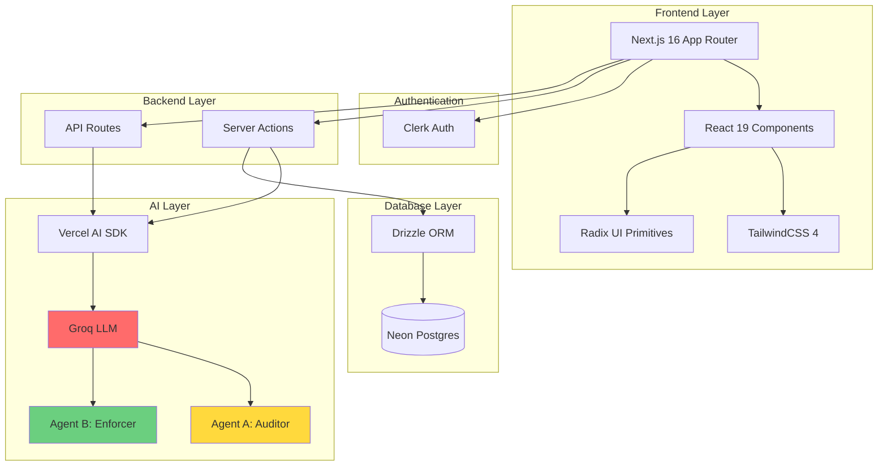
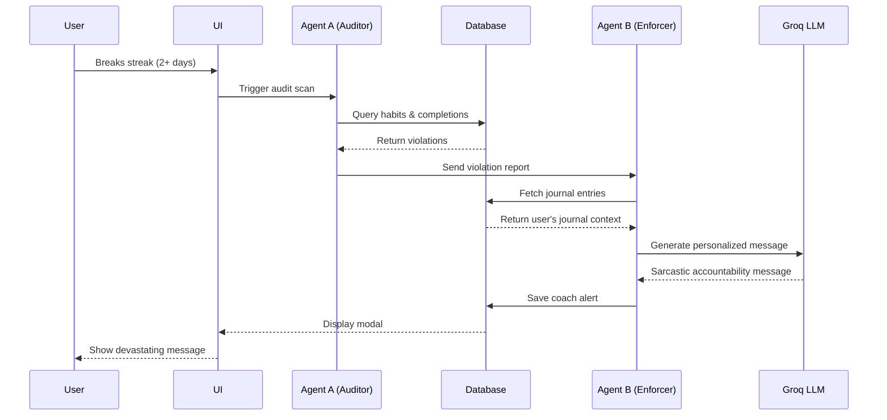
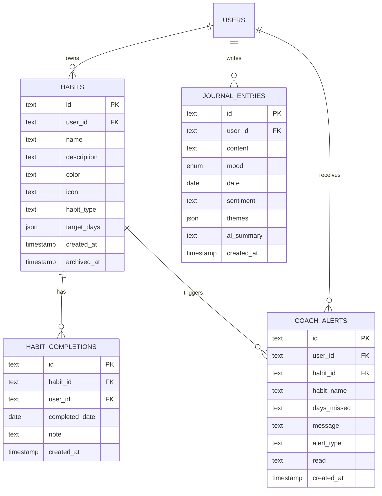
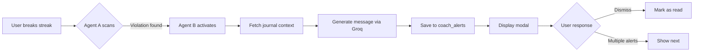
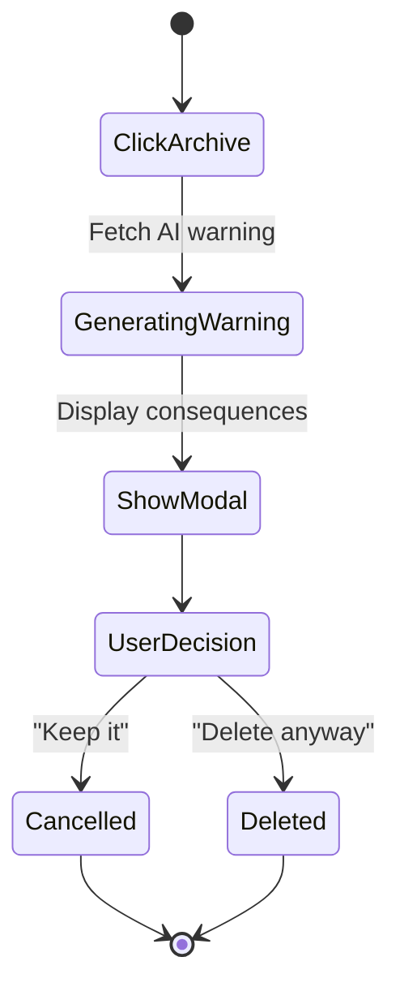

# 🌟 DailyRoutine

> A brutally honest, AI-powered habit tracker that doesn't let you lie to yourself.

[](https://nextjs.org/)
[](https://www.typescriptlang.org/)
[](https://clerk.com/)
[](https://orm.drizzle.team/)

## 📖 Overview

DailyRoutine is not your typical habit tracker. It's a psychological warfare platform disguised as a productivity app. Built with Next.js 16, it combines habit tracking, journaling, and AI-powered accountability to keep you honest about your goals.

### 🎯 Core Features

- **📝 Smart Journaling** - Rich text editor with AI-powered sentiment analysis
- **✅ Habit Tracking** - Daily checklists with streak tracking
- **🔥 Streak Visualization** - Beautiful heatmaps and progress charts
- **🤖 The Ruthless Accountability Coach** - AI agents that shame you into productivity
- **😊 Mood Calendar** - Emoji-based emotional tracking with insights
- **⚠️ Schrödinger's Warning** - Guilt-trip AI that makes deleting habits painful
- **📊 Insights Dashboard** - AI-generated emotional analytics

## 🏗️ Architecture



## 🧠 AI Agent System

The app features a multi-agent AI system for accountability:



### Agent Roles

**Agent A (The Auditor)**
- Scans database for broken streaks
- Detects habits not completed for 2+ days
- Fires violation reports to Agent B

**Agent B (The Enforcer)**
- Receives violation alerts
- Queries user's journal entries for context
- Crafts personalized, psychologically devastating messages
- Uses user's own words against them


## 🗄️ Database Schema



## 🚀 Tech Stack

### Frontend
- **Next.js 16** - App Router with Server Components
- **React 19** - Latest React features
- **TypeScript 5** - Type safety
- **TailwindCSS 4** - Utility-first styling
- **Radix UI** - Accessible component primitives
- **TipTap** - Rich text editor for journaling
- **Recharts** - Data visualization

### Backend
- **Next.js Server Actions** - Type-safe server mutations
- **Drizzle ORM** - TypeScript ORM
- **Neon Postgres** - Serverless Postgres database
- **Zod** - Runtime validation

### AI & Authentication
- **Vercel AI SDK** - AI integration framework
- **Groq** - Fast LLM inference (llama-4-scout-17b)
- **Clerk** - Authentication & user management


## 📁 Project Structure

```
dailyroutine/
├── app/                          # Next.js App Router
│   ├── (app)/                    # Authenticated app routes
│   │   ├── habits/               # Habit management
│   │   ├── journal/              # Journaling interface
│   │   ├── streaks/              # Streak visualization
│   │   ├── insights/             # AI insights dashboard
│   │   └── history/              # Activity calendar
│   ├── (auth)/                   # Auth routes (Clerk)
│   ├── actions/                  # Server Actions
│   │   ├── coach.ts              # AI coach actions
│   │   ├── completions.ts        # Habit completion logic
│   │   ├── habits.ts             # Habit CRUD
│   │   ├── insights.ts           # AI analysis
│   │   ├── journal.ts            # Journal operations
│   │   └── schrodinger.ts        # Delete warning AI
│   └── api/                      # API routes
│       ├── ai/                   # AI streaming endpoints
│       ├── completions/          # Completion API
│       ├── habits/               # Habit API
│       └── journal/              # Journal API
├── components/                   # React components
│   ├── coach/                    # AI coach UI
│   ├── habits/                   # Habit components
│   ├── journal/                  # Journal editor
│   ├── insights/                 # Analytics UI
│   ├── streaks/                  # Streak visualizations
│   ├── history/                  # Calendar components
│   └── ui/                       # Radix UI components
├── lib/                          # Utilities & core logic
│   ├── ai/                       # AI agent implementations
│   │   ├── auditor.ts            # Agent A: Streak scanner
│   │   └── enforcer.ts           # Agent B: Message generator
│   ├── db/                       # Database
│   │   ├── index.ts              # Drizzle client
│   │   └── schema.ts             # Database schema
│   └── repositories/             # Data access layer
│       ├── habits.ts
│       ├── completions.ts
│       ├── journal.ts
│       └── insights.ts
└── scripts/                      # Utility scripts
    ├── seed-broken-streak.ts     # Test data generator
    └── test-coach.ts             # AI coach tester
```

## 🎨 Key Features Deep Dive

### 1. The Ruthless Accountability Coach



**How it works:**
- Runs automatically on page load (24h cooldown)
- Manual trigger via "Summon The Coach" button
- Uses journal entries to personalize guilt trips
- Three severity levels: motivate, warning, shame


### 2. Schrödinger's Warning System

When you try to delete a habit, the AI generates a personalized warning:



**Features:**
- Glitch aesthetic UI
- AI analyzes habit history
- Calculates "catastrophic consequences"
- Guilt-trips using your own data

### 3. Mood Calendar with Emoji Tracking

Visual mood tracking with consistent layout:
- Fixed cell structure (date top-left, emoji centered)
- 6 sentiment types with unique emojis
- Hover effects and today indicator
- Integrated with journal sentiment analysis


## 🛠️ Installation & Setup

### Prerequisites
- Node.js 20+
- PostgreSQL database (Neon recommended)
- Clerk account
- Groq API key

### Environment Variables

Create a `.env` file:

```bash
# Database
DATABASE_URL="postgresql://..."

# Clerk Authentication
NEXT_PUBLIC_CLERK_PUBLISHABLE_KEY="pk_..."
CLERK_SECRET_KEY="sk_..."
NEXT_PUBLIC_CLERK_SIGN_IN_URL="/sign-in"
NEXT_PUBLIC_CLERK_SIGN_UP_URL="/sign-up"

# AI
GROQ_API_KEY="gsk_..."
```

### Installation Steps

```bash
# 1. Clone the repository
git clone <your-repo-url>
cd dailyroutine

# 2. Install dependencies
npm install

# 3. Set up database
npm run db:push

# 4. Run development server
npm run dev
```

Visit `http://localhost:3000`

